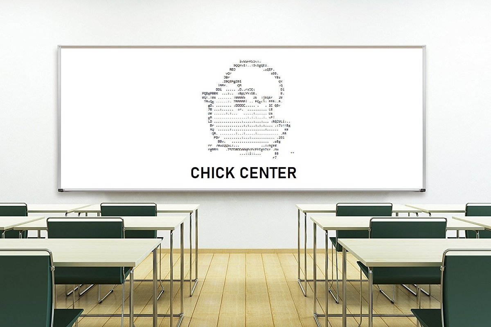
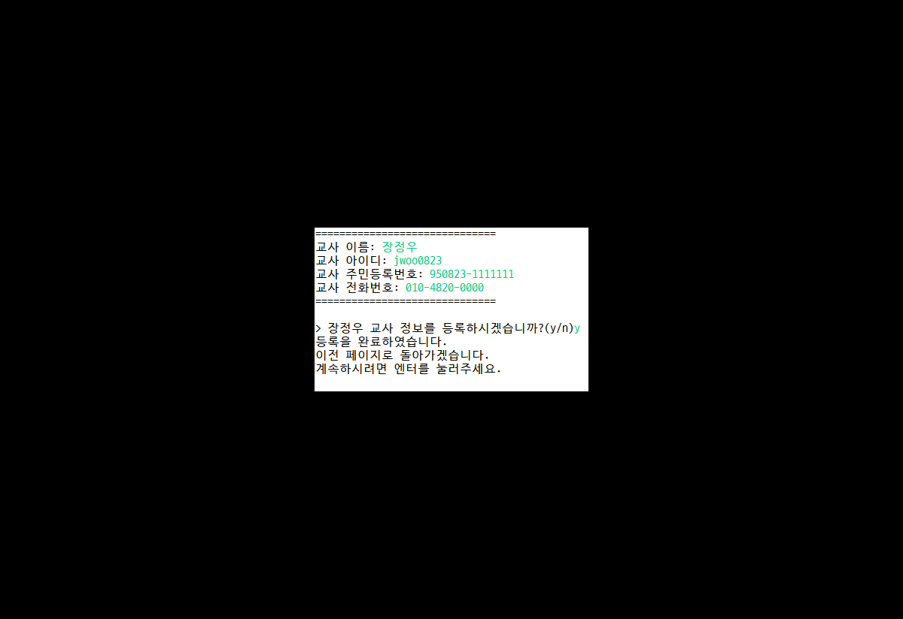
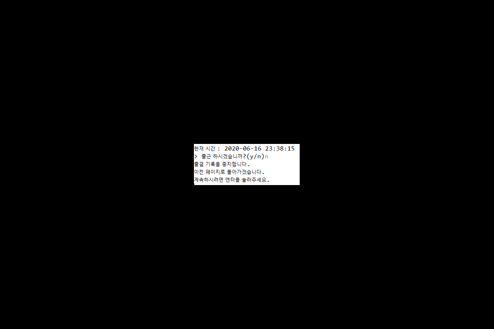
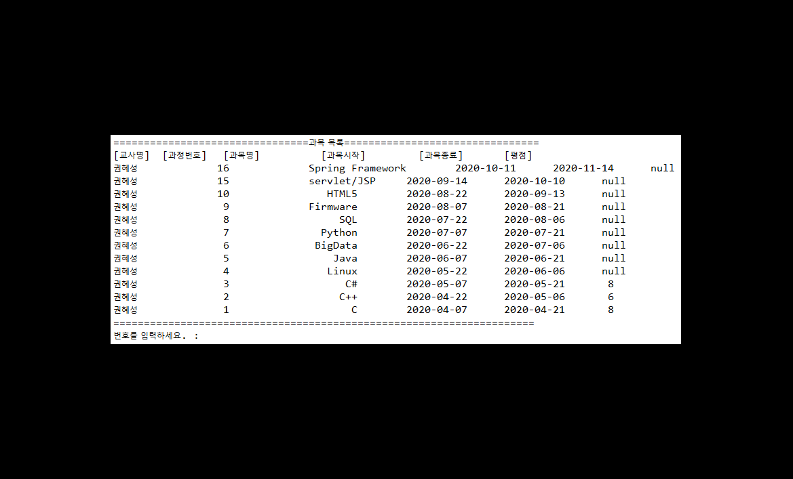

# EducationCenter
 

### 👋 Introduction
<table>
	<tr>
		<th>프로젝트 명 </th>
	    <th>ChickCenter</th>
	    <th>개발기간</th>
	    <th>2020.06.01. ~ 2020.06.17.</th>
	</tr>
	<tr>
		<th>프로젝트 성격</th>
		<th>세미 프로젝트</th>
		<th>개발인원</th>
		<th>팀 / 6명 
		  (<a href="https://github.com/kdw0725">김동욱</a>｜
		  <a href="https://github.com/JeongWoo-Jang">장정우</a>｜
		  <a href="https://github.com/ssj5037">신수진</a>｜
		  <a href="https://github.com/Kimyoung-hyun">김영현</a>｜
		  <a href="https://github.com/Heesu-Jeong">정희수</a>｜
		  <a href="https://github.com/jihyun-back">백지현</a>)
		</th>
    </tr>
    <tr>
        <th>프로젝트 개요</th>
        <th>명소 프로그램</th>
        <th>개발환경&nbsp;</th>
        <th>Windows10</th>
    </tr>
    <tr>
        <th colspan="5">사용 도구</th>
    </tr> 
    <tr>
        <th>개발언어</th>
        <th colspan="3">Java(JDK 1.8) ｜Oracle </th>
    </tr>
    <tr>
        <th>형상관리</th>
        <th colspan="3">Github, Git</th>
    </tr>
    <tr>
        <th>개발도구</th>
        <th colspan="3">Eclipse JEE, Oracle SQL Developer, eXERD</th>
    </tr>
    <tr>
        <th>사용기술</th>
        <th colspan="3">Java Console, JDBC, SQL, PLSQL</th>
    </tr>
</table>

### 👋  Appearance
교육센터 관리 프로그램입니다.
### 📼  관리자
<table>
	<tr>
		<td></td>
	</tr>
</table>

### 📼  교사
<table>
	<tr>
		<td></td>
	</tr>
</table>

### 📼  학생
<table>
	<tr>
		<td></td>
	</tr>
</table>

### 📑 Role & Member
<table>
	<tr>
		<th width="16%">업무 / 구성원</th>
        <th width="14%">김동욱</th>
        <th width="14%">신수진</th>
        <th width="14%">김영현</th>
        <th width="14%">장정우</th>
        <th width="14%">정희수</th>
        <th width="14%">백지현</th>
	</tr>
	<tr>
		<td align = "center">프로젝트 기획 및 설계</td>
		<td align = "center" colspan = "6">회의, 의견 제안</td>
	</tr>
	<tr>
		<td align = "center">요구분석</th>
		<td align = "center" colspan = "6">회의, 의견 제안, 문서 작성</td>
	</tr>
	<tr>
		<td align = "center">데이터 설계</th>
		<td align = "center" colspan = "6">회의, 의견 제안, ERD 작성</td>
	</tr>
	<tr>
		<td align = "center">기능명세서</th>
		<td align = "center" colspan = "6">회의, 의견 제안, 문서 작성</td>
	</tr>
	<tr>
		<td align = "center">화면 설계</th>
		<td align = "center" colspan = "6">회의, 의견 제안</td>
	</tr>
	<tr>
		<td align = "center">DB</td>
		<td align = "center" colspan = "3">관리자</td>
		<td align = "center">교육생</td>
		<td align = "center" colspan = "2">교사</td>
	</tr>
	<tr>
		<td align = "center">소스(코딩)</td>
		<td align = "center">메인문 작성, 회원가입, 수강신청, 코드 오류 수정 및 로직 검증 관리자 출결 관리 설계</td>
		<td align = "center">관리자 메뉴 교사관리, 관리자메뉴 학생 관리 관리자메뉴 출결 조회 및 관리</td>
		<td align = "center">관리자 개설 과정 관리 설계,  추가 요구사항(체온, 국비지원),  교사 출결관리 설계</td>
		<td align = "center">학생 메뉴 전체 설계, 추가 요구사항(취업)설계</td>
		<td align = "center">교사 메뉴 시험, 성적 관리 설계, 교사 메뉴 학생 출결 조회 설계</td>
		<td align = "center">교사 강의 스케줄 및 배점 관리, 교사 추가 요구사항(체온, 평가)</td>
	</tr>
	<tr>
		<td align = "center">발표자료</td>
        <td align = "center">발표 대본 작성</td>
        <td align = "center">PPT 제작</td>
        <td align = "center">관리자 부분 화면 제작</td>
        <td align = "center">회원가입 및 수강신청 화면 제작, 발표 보조</td>
        <td align = "center">발표</td>
        <td align = "center">학생 및 교사 부분 화면 제작</td>
	</tr>
</table>